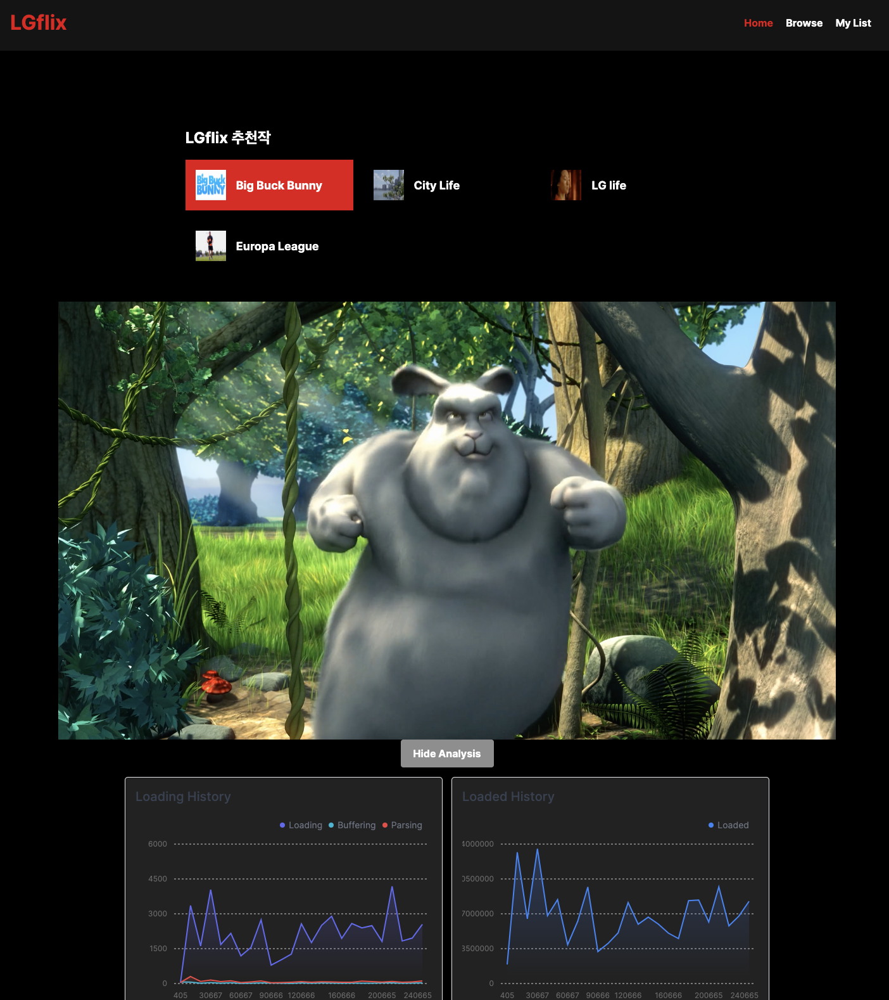

## 1. 서론 (Introduction)

### 1.1 목적 (Purpose)
-   본 문서의 목적은 적응형 미디어 컨텐츠 재생과 이를 사용하면서 발생하는 사용자 로그 및 미디어 데이터를 추출하고 서버로 전송하며, 동시에 실시간 시각화하는 클라이언트 프로그램의 요구사항을 기술하는 것이다. 

### 1.2 범위 (Scope)
이 문서에는 아래의 요구 사항이 포함되어 있다.
-   사전 제공된 m3u8 링크를 통해 미디어를 재생한다.
-   미디어 재생과정에서 미디어 재생 데이터를 추출하고 서버로 전송한다.
-   추출한 미디어 재생 데이터를 클라이언트에서 실시간으로 시각화하여 제공한다.

### 1.3 용어 및 약어 정리 (Definitions and Abbreviations)
-   Codec (Coder & Decoder) : 음성 또는 영상의 신호를 디지털 신호로 변환하는 코더와 그 반대로 변환시켜 주는 디코더를 통틀어 부르는 용어이다.
-   GUI (Graphic User Interface) : 사용자가 편리하게 사용할 수 있도록 입출력 등의 기능을 알기 쉬운 아이콘 따위의 그래픽으로 나타내서 사용자와 컴퓨터가 상호 작용하는 방식이다. 
-   CLI (Command Line Interface) : 텍스트 터미널을 통해 사용자와 컴퓨터가 상호 작용하는 방식이다.
-   UI (User Interface) : 사용자와 사물 또는 시스템, 컴퓨터 프로그램 등 사이에서 의사소통을 할 수 있도록 일시적 또는 영구적인 접근을 목적으로 만들어진 물리적, 가상적 매개체를 뜻한다. 
-   POSIX (Portable Operating System Interface) : 서로 다른 UNIX OS의 공통 API를 정리하여 이식성이 높은 유닉스 응용 프로그램을 개발하기 위한 목적으로 IEEE가 책정한 애플리케이션 인터페이스 규격이다.
-   API (Application Programming Interface) : 응용 프로그램에서 사용할 수 있도록, 운영 체제나 프로그래밍 언어가 제공하는 기능을 제어할 수 있게 만든 인터페이스를 뜻한다.
-   React.js : 자바스크립트의 프론트엔드 오픈소스 라이브러리로써, 컴포넌트 구조에 기반한 UI 제작 기능을 제공한다.
-   Next.js : Vercel에서 제작한 React.js 기반의 웹 프레임워크로, 통합된 웹 어플리케이션 구축 환경을 제공하고 SSR과 함께 정적 생성 기능을 통해 SEO 최적화를 달성할 수 있다.

### 1.4 참고 문헌 (Reference)
-  https://gstreamer.freedesktop.org/

---

## 2. 종합기술 (Overall Description)

### 2.1 시스템 인터페이스 (System Interface)
-   시스템은 Vercel에서 배포되며, 재생은 클라이언트에서 구현된 hls 라이브러리를 통해 미디어를 재생한다. 미디어 재생 환경에서는 Video를 시청할 수 있도록 페이지 내에 구현된 Video DOM을 제공하고 조작을 위한 GUI를 지원한다.

### 2.2 시스템 컨텍스트 (System Context)

**User**

클라이언트 프로그램을 사용하는 사용자를 의미한다. 사용자는 클라이언트 프로그램에서 제공하는 인터페이스를 통해 지원하는 기능을 사용할 수 있다.

**Client**

 클라이언트 프로그램의 주 기능은 미디어를 재생하고, 실시간 재생 정보를 시각화하는 것이다.

**Server**

클라이언트 프로그램에서 요청하는 정보를 제공하기 위한 서버이다. 미디어 정보를 데이터베이스에 저장하여 관리하는 주체이다.

### 2.2 사용자 인터페이스

-   사용자들의 편리성을 중심으로 재생, 일시정지, 중지 등의 기능을 사용할 수 있도록 UI를 구성하도록 한다.
-   시각화 데이터를 표시하기 위한 별도의 버튼과 미디어 목록을 제공한다.

---

## 3. 상세 요구사항 (Specific Requirements)

### 3.1. 기능적 요구사항(Functional Reqirements)

#### 3.1.1. 미디어 목록 제공

- 사용자는 다양한 유형의 미디어 콘텐츠를 제공받을 수 있어야 한다.
- 사용자는 콘텐츠를 검색하고 목록에서 선택하여 재생할 수 있어야 한다.

#### 3.1.2. 미디어 기본 재생 기능

- 사용자는 미디어를 재생, 일시정지, 앞으로/뒤로 이동할 수 있어야 한다.

#### 3.1.3. 배속 기능

- 사용자는 원하는 배속으로 미디어를 재생할 수 있어야 한다.

#### 3.1.4. 동영상 시청 기록 및 품질 데이터를 이용한 시각화 및/또는 킬러 기능 제공

- 사용자의 동영상 시청 기록 및 품질 데이터를 분석하여 시각화 기능을 제공해야 한다.
